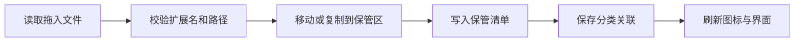

# 桌面舱 DesktopDock 完整项目说明书

> 版本：0.3.0
> 平台：Windows 10/11 x64  
> 最终程序：`DesktopDock.exe`  
> 项目仓库：<https://github.com/User-CJF/DesktopDock>  
> 文档状态：当前版本唯一有效说明书

---

## 1. 项目概述

DesktopDock 是一款本地优先的 Windows 桌面整理与效率工具。它不是传统的大型管理窗口，而是挂接在 Windows 桌面宿主层右侧的窄幅状态栏：回到桌面时可见，打开浏览器、编辑器、游戏等普通软件后会被软件窗口自然覆盖，不会悬浮在其他软件右侧。

产品的核心不是自动替用户决定分类，而是提供一个固定的“桌面仓”，将桌面普通快捷方式安全收纳后交给用户自行建立、删除和调整分类。

### 1.1 核心目标

- 获取当前 Windows 桌面中的真实快捷方式和真实应用图标。
- 收纳当前用户桌面的普通快捷方式，同时保留“此电脑”“回收站”等系统图标。
- 分类全部由用户创建，可拖动归类，也可通过菜单完成归类。
- 只显示在桌面右侧，不置顶、不挤压其他应用窗口。
- 提供文件、待办、天气、媒体和分组设置等桌面辅助能力。
- 使用单个免安装 EXE 交付，并支持开机自动启动。
- 用户数据保存在本机，不要求账号，不上传本机路径或待办内容。

### 1.2 产品原则

| 原则 | 实现方式 |
| --- | --- |
| 原生优先 | Windows Shell 图标、Explorer 桌面宿主、系统媒体会话、系统通知和回收站 |
| 本地优先 | 分类、待办、文件索引、设置和快捷方式均保存在当前用户本机 |
| 克制扩展 | 固定桌面仓，其余分类完全由用户决定；辅助模块可单独关闭 |
| 轻量常驻 | 460–560px 自适应窄栏、托盘常驻、增量索引、天气缓存，不占用应用工作区 |

---

## 2. 最终交付与运行

### 2.1 最终文件

本地交付目录只保留：

```text
.git/
.gitignore
DesktopDock.exe
DesktopDock.md
```

完整源码保存在 GitHub `main` 分支。`DesktopDock.exe` 是本地构建产物，由 `.gitignore` 排除，不提交到源码历史。

### 2.2 运行方式

1. 将 `DesktopDock.exe` 放在一个长期保存的位置。
2. 双击即可运行，无需安装。
3. 第一次启动会初始化本地数据库、图标缓存和快捷方式保管目录。
4. 单击顶部齿轮，在面板设置中开启“开机自动启动”后，程序会随 Windows 登录启动。
5. 单击右上角隐藏按钮后，程序保留在系统托盘。
6. 要彻底结束程序，请在面板设置或托盘菜单中选择“退出”。

> 当前构建没有配置商业代码签名证书。如果 Windows SmartScreen 提示未知发布者，请先核对本文档末尾的 SHA-256。

### 2.3 桌面层行为

Windows 版通过受控 Win32 调用，将 Electron 窗口挂接到 Explorer 的 `Progman/WorkerW` 桌面宿主层。

- Dock 固定在当前显示器工作区右侧。
- 不启用 `alwaysOnTop`。
- 不注册系统 AppBar，不占用其他软件的工作区域。
- 普通应用窗口会覆盖 Dock。
- Explorer 重启或显示器参数变化后会重新尝试挂接。
- 如果第三方桌面 Shell 不提供标准桌面宿主，程序会回退为非置顶右侧窗口。

---

## 3. 界面与视觉规范

### 3.1 页面结构

界面宽度取当前显示器工作区的约 41%，并限制在 460–560 CSS 像素；纵向占满任务栏上方的工作区。

```text
38px 全局搜索（应用 / 文件 / 网页）
┌──────────────┬──────────┐
│ 天气          │ 时间 / 媒体 │
│ 桌面仓 / 分类  │ 待办 / 随记 │
│ 文件          │ 自建分类    │
└──────────────┴──────────┘
```

界面没有标题栏、侧边栏和底部导航。所有能力在同一张桌面信息墙中同时可见：

- 460–519px 使用约 58% / 42% 的双列非对称结构；
- 520–560px 使用约 35% / 34% / 31% 的三列结构；
- 卡片之间保持 4px 间距，圆角 6px，标题栏高度 31px；
- 卡片可拖动排序、折叠、隐藏和切换紧凑/标准/加高尺寸；
- 拖动不是唯一操作，卡片菜单提供向前和向后移动按钮；
- 空白区域保持半透明，使桌面壁纸继续成为界面的一部分。

### 3.2 视觉语言

- 应用品牌图标使用用户指定的蓝色三层图形。
- 使用 Windows 11 Acrylic/Mica 半透明材质；深色卡片为 `rgba(31,43,47,.78)`，浅色卡片为 `rgba(235,247,252,.82)`，背景模糊 22px。
- 主强调色为 Windows 蓝，分类使用轻量识别色，不使用装饰性渐变文字。
- 字体优先使用 Segoe UI Variable、Segoe UI、Microsoft YaHei UI。
- 功能图标统一使用 Segoe Fluent Icons；应用图标来自 Windows Shell。
- 键盘焦点使用清晰的蓝色外框。
- 支持 `prefers-reduced-motion`。
- 460px 和 540px 两个验收宽度均禁止横向溢出，页面只使用一个纵向滚动区域。

---

## 4. 桌面仓与快捷方式

### 4.1 扫描范围

桌面模块读取：

- 当前用户桌面；
- 公共桌面；
- DesktopDock 专用快捷方式保管区。

支持的快捷方式类型：

- `.lnk`
- `.url`
- `.appref-ms`

### 4.2 真实图标

快捷方式图标由主进程按以下顺序获取：

1. 快捷方式中显式指定的图标；
2. 快捷方式目标文件的图标；
3. Windows Shell 为该文件返回的图标；
4. 稳定的后备图标。

图标转换成 PNG Data URL 后进入本地图标缓存。渲染进程只接收不透明快捷方式 ID，不接收完整本机路径。

### 4.3 自动收纳

“自动收纳桌面快捷方式”默认开启。

- 当前用户桌面中的普通快捷方式会移动到 DesktopDock 保管区。
- “此电脑”“回收站”“控制面板”等系统图标由 Explorer 管理，不属于普通快捷方式文件，因此不会被移动或删除。
- 普通文件和文件夹不会被快捷方式收纳功能移动。
- 公共桌面快捷方式由所有用户共享，可能需要管理员权限，因此只读展示，不自动移动。
- 同名快捷方式使用安全名称，不覆盖已有文件。

### 4.4 分类规则

- “桌面仓”是固定入口，不能删除。
- 不再自动创建办公、开发、娱乐等分类。
- 所有分类由用户自行创建并选择识别色。
- 分类可以改名和删除。
- 删除分类只会把其中快捷方式移回桌面仓，不删除快捷方式本身。

### 4.5 拖放和替代操作

- 将桌面仓中的快捷方式拖到分类框即可归类。
- 可从 Windows 桌面直接拖入桌面仓。
- 可从 Windows 桌面直接拖入指定分类。
- 从当前用户桌面拖入时使用移动；从其他目录拖入时使用复制。
- 每个快捷方式都提供“移动到分类”菜单，作为拖放的鼠标和键盘替代操作。
- 双击快捷方式或聚焦后按 Enter 可以启动目标。

---

## 5. 待办模块

### 5.1 任务字段

- 标题与备注；
- 八种颜色标记；
- 截止时间；
- 提醒时间；
- 不重复、每天、每周、每月；
- 最多 20 个附件路径；
- 收藏、完成状态和用户排序。

### 5.2 提醒与重复

- DesktopDock 运行期间每 30 秒检查一次待提醒任务。
- 到达提醒时间后使用 Windows 系统通知。
- 提醒记录会被原子标记，避免重复通知。
- 重复任务完成后自动创建下一期任务。
- 下一期保留标题、备注、颜色、重复规则和附件。

### 5.3 任务操作

- 新建、编辑、完成、恢复和删除任务；
- 在“管理全部待办”中使用上下按钮调整顺序；
- 批量选择任务；
- 批量完成或删除；
- 卡片内快速完成、收藏和编辑。

附件只记录本机路径，不复制、不上传附件内容。

### 5.4 随记

- 支持新增、编辑和删除便签；
- 支持薄荷、沙色、玫瑰和蓝色四种标记；
- 支持固定便签；
- 便签只保存在 Electron 本地存储中，不同步到云端；
- 卡片尺寸会决定同时展示的便签数量。

---

## 6. 文件模块

### 6.1 目录与索引

默认提供桌面、下载、文档、图片和视频目录，也可以收藏其他本机目录。

文件索引采用本地 SQLite：

- 限制单个根目录的最大文件数和扫描深度；
- 忽略 `node_modules`、`.git`、回收站等目录；
- 不扫描整块磁盘；
- 不上传文件名称或路径。

### 6.2 显示与查找

- 当前模块搜索；
- 最近修改、名称、大小三种排序；
- 图标和列表两种布局；
- PNG、JPEG、GIF、BMP、WebP 显示真实缩略图；
- 其他文件显示扩展名标记。

### 6.3 文件操作

- 拖入文件到当前目录；
- 拖入时复制文件，原文件保留；
- 默认程序打开；
- 在资源管理器中显示；
- 重命名；
- 移到 Windows 回收站。

重命名会拒绝 Windows 非法字符和路径分隔符。删除调用 `shell.trashItem`，不直接永久删除。

---

## 7. 天气模块

天气使用 Open-Meteo 地理编码和天气预报接口，缓存有效期为 30 分钟。

### 7.1 定位方式

- 在设置页手动填写城市；
- 在天气页请求当前位置；
- 系统定位需要 Windows 位置权限；
- 定位不可用时可以继续使用手动城市。

### 7.2 天气内容

- 当前温度和体感温度；
- 天气状态；
- 湿度、风速、风向、气压、降水概率；
- 未来六小时预报；
- 七天最高温、最低温、天气和降水概率；
- 日出、日落、紫外线和最大风速数据。

### 7.3 布局

- 标准；
- 紧凑；
- 逐小时；
- 周预报。

天气背景会根据晴、多云和降水进行轻量变化。

---

## 8. Windows 媒体模块

媒体模块通过 Windows Global System Media Transport Controls 获取当前活动媒体会话。

可以读取：

- 曲名；
- 艺术家；
- 专辑；
- 播放/暂停状态；
- 当前播放位置；
- 总时长。

可以控制：

- 上一首；
- 播放/暂停；
- 下一首；
- 降低系统音量；
- 提高系统音量。

具体播放器是否提供元数据、封面、随机或循环能力由播放器实现。为了保持通用播放器兼容性，当前版本不伪造随机/循环指令，也不缓存受版权保护的封面。

---

## 9. 设置模块

顶部齿轮打开紧凑的面板设置：

- 开机自动启动；
- 自动收纳桌面快捷方式；
- 深色、浅色、跟随系统；
- 逐张显示或隐藏天气、待办、随记、文件、时间、媒体、桌面仓和自建分类；
- 导出配置和退出程序。

每张卡片自己的更多菜单还提供折叠、隐藏、切换尺寸、向前/向后移动；自建分类可在此删除。

设置通过 SQLite 持久化，并支持 JSON 配置导入与导出。

---

## 10. 数据、安全与隐私

### 10.1 本地数据

| 数据 | 存储方式 | 恢复性 |
| --- | --- | --- |
| 分类、待办、设置、索引 | 当前用户 `userData/data.db` | 删除 EXE 不会自动删除数据 |
| 随记、卡片布局 | Electron 本地存储 | 随当前用户配置持久化 |
| 快捷方式 | `userData/desktop-shortcuts` | 有保管清单，可恢复到原桌面 |
| 天气 | `weather-cache.json` | 可删除，联网后重建 |
| 图标 | 版本化图标缓存 | 可删除，由 Windows Shell 重建 |

### 10.2 Electron 安全边界

- `contextIsolation: true`
- `nodeIntegration: false`
- `sandbox: true`
- 外部导航和新窗口默认拒绝
- 渲染进程通过预加载白名单 API 调用主进程
- 文件、应用和快捷方式使用格式受限的不透明 ID
- 主进程在执行系统操作前重新解析并校验实际路径

### 10.3 网络边界

天气是唯一自动联网模块。只有用户主动选择“网页搜索”时，DesktopDock 才会把输入的搜索词交给系统默认浏览器并打开 Bing；本机路径、分类、待办、随记和媒体状态不会因此上传。

---

## 11. 技术架构

### 11.1 技术栈

| 层 | 技术 | 职责 |
| --- | --- | --- |
| 桌面容器 | Electron 43 | 窗口、托盘、桌面宿主、通知、Shell 与 IPC |
| 界面 | Vue 3、Vite 8、原生 JS/CSS | 页面壳层、状态、拖放和交互 |
| 数据 | Node SQLite、JSON 缓存 | 分类、待办、索引、设置和缓存 |
| Windows 集成 | Win32、PowerShell、Windows Shell | WorkerW、媒体会话、图标和开机启动 |
| 打包 | electron-builder portable | 单文件 Windows x64 EXE |

### 11.2 进程职责

- **主进程**：文件系统、数据库、网络和 Windows 系统调用。
- **预加载层**：暴露参数受限的 IPC 白名单。
- **渲染进程**：界面与交互，不直接访问 Node.js 或文件系统。
- **服务层**：桌面仓、桌面整理、待办、文件索引、天气、媒体、设置和图标缓存。

### 11.3 启动流程


### 11.4 拖入分类流程



---

## 12. 开发、构建与测试

### 12.1 常用命令

```powershell
pnpm install
pnpm run dev
pnpm run check
pnpm run smoke
pnpm run portable:win
```

| 命令 | 作用 |
| --- | --- |
| `pnpm run dev` | 开发模式 |
| `pnpm run check` | 主进程、预加载和 UI 语法检查，运行全部自动测试并构建 |
| `pnpm run smoke` | 启动 500px Electron 窗口，验证真实 IPC 和五个模块 |
| `pnpm run portable:win` | 生成 `release/DesktopDock.exe` |

### 12.2 自动测试

当前包含 12 项 Node 自动测试：

- 应用索引和分类；
- 普通桌面文件整理和还原；
- 桌面快捷方式收纳、启动和恢复；
- 文件索引；
- 图标缓存；
- 系统媒体动作；
- 设置导入导出；
- 桌面仓分类持久化；
- 待办详情、排序、提醒和重复；
- 天气获取和缓存。

### 12.3 冒烟测试

源码和最终便携 EXE 都必须验证：

- 安全预加载桥接；
- 460px 深色双列与 540px 浅色三列；
- 无横向溢出；
- 桌面仓、文件、待办、随记、天气、时间、媒体和面板设置卡片；
- 分类与待办 CRUD；
- 卡片跨列排序、折叠、隐藏和尺寸持久化；
- 设置持久化；
- 图标和文件接口不向渲染进程泄露完整路径。

冒烟模式不会移动真实桌面快捷方式。

---

## 13. Git 与版本管理

远程仓库：<https://github.com/User-CJF/DesktopDock.git>  
主分支：`main`

每次修改应按以下顺序执行：

1. 恢复或克隆完整源码。
2. 完成最小范围修改。
3. 运行 `pnpm run check`。
4. 运行源码 Electron 冒烟测试。
5. 生成 `DesktopDock.exe`。
6. 对最终 EXE 运行独立冒烟测试。
7. 更新本说明书中的大小和 SHA-256。
8. 提交并推送 GitHub。
9. 将本地目录恢复为仅保留 EXE、MD 说明书和 Git 配置。

`DesktopDock.exe`、`node_modules`、`dist`、`release` 和运行数据库不提交到 Git。

---

## 14. 快捷键

| 操作 | 首选组合键 | 冲突时备用键 |
| --- | --- | --- |
| 聚焦搜索 | `Alt + Space` | `Ctrl + Shift + Space` |
| 显示/隐藏 DesktopDock | `Alt + D` | `Ctrl + Shift + D` |
| 启动聚焦的快捷方式 | `Enter` | — |
| 关闭弹层 | `Esc` | — |

---

## 15. 已知边界与故障处理

| 现象 | 原因与处理 |
| --- | --- |
| 公共桌面快捷方式仍在桌面 | 公共桌面由所有用户共享，DesktopDock 只读展示；需要管理员自行管理 Public Desktop |
| 定位天气失败 | 在 Windows 设置中开启位置权限，或手动输入城市 |
| 媒体没有曲名 | 播放器没有接入 Windows 媒体会话；先播放一次或换用支持 GSMTC 的播放器 |
| Dock 未显示 | 检查托盘并选择“显示桌面舱”；Explorer 重启后可重新启动 DesktopDock |
| 快捷方式没有正确图标 | 刷新桌面；检查快捷方式目标是否存在 |
| 开机启动失效 | EXE 移动后重新关闭并开启开机启动，使 Windows 更新启动路径 |

系统图标由 Explorer 管理，不会进入桌面仓，也不会被 DesktopDock 删除。系统定位、通知和媒体元数据取决于 Windows 权限及具体播放器能力。

---

## 16. 最终构建校验

| 项目 | 值 |
| --- | --- |
| 文件名 | `DesktopDock.exe` |
| 文件大小 | `98,271,012 bytes` |
| SHA-256 | `5D9EA62C27BF1A59D050B695EA5D47A484446088E161520EC3AF7797DFBB3BFC` |
| 自动测试 | 12 项全部通过 |
| EXE 独立冒烟 | `passed=true` |

---

文档结束。
